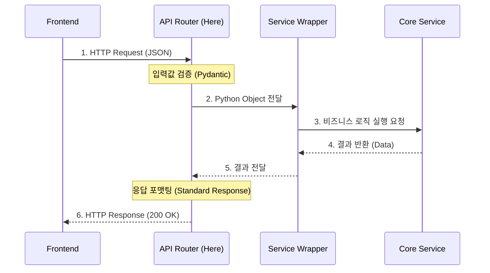

# API Layer (Tier 1) Documentation

**`api/`** 디렉토리는 3-Tier 아키텍처의 **1단계 (Interface/Controller Layer)**입니다.

이 계층의 핵심 역할은 **"외부 요청의 수신과 전달"**입니다. 비즈니스 로직을 전혀 포함하지 않으며, 오직 클라이언트와 시스템 내부(Application/Services)를 연결하는 **인터페이스 역할**만 수행합니다.

### 🎯 핵심 책임
1.  **진입점 (Entry Point)**: 웹 프론트엔드로부터 오는 모든 HTTP 요청을 가장 먼저 받습니다.
2.  **검증 (Validation)**: 요청 데이터가 올바른 형식을 갖췄는지 검사합니다 (Pydantic).
3.  **라우팅 (Routing)**: 요청의 목적에 따라 적절한 담당 부서(Application Layer)로 연결합니다.
4.  **응답 (Response)**: 처리 결과를 표준화된 JSON 포맷으로 클라이언트에게 돌려줍니다.

---

## 파일별 역할 및 상세 명세

### 1. `main.py` (엔트리포인트)
*   **Role:** 웹 서버(Application)의 진입점이자 라우터 통합 관리.
*   **Key Features:**
    *   **FastAPI App 생성:** `app = FastAPI()` 인스턴스 초기화.
    *   **Router 등록:** `auth`, `agents`, `chat` 등 하위 라우터를 `app.include_router()`로 연결.
    *   **Middleware 설정:** CORS, 로깅 등 전역 설정 적용.
*   **Code Example:**
    ```python
    app = FastAPI(title="AI Agent System")
    app.include_router(auth.router)
    app.include_router(chat.router)
    ```
*   **Flow:**
    > Server Start (`uvicorn`) → **main.py** → Routes Init → Ready to Serve

---

### 2. `auth.py` (인증 및 보안)
*   **Role:** 사용자 신원 확인 및 세션 토큰 발급.
*   **Key Features:**
    *   `POST /register`: 신규 회원 가입 (비밀번호 암호화).
    *   `POST /login`: JWT 액세스 토큰 발급.
*   **Flow:**
    > User Input (ID/PW) → **Auth Router** → `app.auth` (Hash 검증) → `DB` (User 조회) → Token 반환

---

### 3. `agents.py` (에이전트 관리)
*   **Role:** AI 에이전트 생성/조회 요청 진입점.
*   **Key Features:**
    *   `POST /draft`: 에이전트 생성 마법사 시작 (초안 생성).
    *   `GET /list`: 사용 가능한 에이전트 목록 조회 (Hub 연동).
    *   `POST /publish`: 작성 완료된 에이전트 배포.
*   **Key Code:**
    ```python
    @router.post("/draft")
    def create_draft(request: DraftRequest):
        # Wrapper를 통해 Core Service 호출
        return agent_service.create_draft(request.user_id, request.intent)
    ```
*   **Flow:**
    > User Request → **Agents Router** → `AgentWrapper` → `AgentManager` (Core) → Redis/DB

---

### 4. `chat.py` (대화 인터페이스)
*   **Role:** 사용자-AI 간 실시간 메시지 송수신.
*   **Key Features:**
    *   `POST /message`: 사용자 메시지 전송 및 답변 수신.
    *   `GET /history/{session_id}`: 이전 대화 기록 조회.
*   **Flow:**
    > User Message → **Chat Router** → `Orchestrator` (Core) → LLM Processing → Response

---

### 5. `__init__.py` (패키지 초기화)
*   **Role:** 해당 디렉토리를 Python 패키지로 인식시킴.
*   **Key Features:**
    *   하위 모듈(`agents`, `auth` 등)을 외부에서 쉽게 Import 할 수 있도록 노출함.
    *   `app.api` 네임스페이스 정의.

---

## 표준 요청 처리 흐름 (Standard Request Flow)

API 요청 처리 파이프라인 구조.



---

## 📂 상세 디렉토리 구조

```
api/
├── main.py                     # [Entry Point] 앱 실행 및 라우터 등록
├── auth.py                     # [Auth] 사용자 인증 (로그인/가입)
├── agents.py                   # [Agent] 에이전트 생성/조회 (Wizard)
├── chat.py                     # [Chat] 오케스트레이터 대화 중계
└── __init__.py                 # 패키지 초기화
```
