# Orchestrator 시퀀스 다이어그램

**작성일:** 2026-02-08  
**작성자:** Kwon (feature-Y)  
**스타일:** Agent/Drive 팀원 다이어그램과 동일

---

## 📊 Flow 1: User Request Processing (사용자 요청 처리)

### 5-Layer Pipeline 전체 흐름

```mermaid
sequenceDiagram
    participant User as 사용자
    participant Pipeline as Pipeline<br/>(services/orchestrator/pipeline.py)
    participant Router as LLM (Router)<br/>(Gemini Flash)
    participant Researcher as Milvus (Researcher)<br/>(Vector DB)
    participant Reasoner as LLM (Reasoner)<br/>(GPT-5)
    participant Synthesizer as LLM (Synthesizer)<br/>(Claude 4.5)
    participant Guardrail as LLM (Guardrail)<br/>(DeepSeek-R1)

    User->>Pipeline: process(user_input, user_id)
    
    rect rgb(60, 60, 60)
        Note over Pipeline,Router: Step 1. 의도 파악
        Pipeline->>Router: classify_intent(user_input)
        Router-->>Pipeline: "QUERY" / "SEARCH" / "ANALYSIS"
    end
    
    rect rgb(60, 60, 60)
        Note over Pipeline,Researcher: Step 2. 관련 문서 검색
        Pipeline->>Researcher: search_documents(query, top_k=5)
        Researcher-->>Pipeline: [Chunk1, Chunk2, ...]
    end
    
    rect rgb(60, 60, 60)
        Note over Pipeline,Reasoner: Step 3. 답변 생성 (추론)
        Pipeline->>Reasoner: generate_response(question, chunks, intent)
        Reasoner-->>Pipeline: Raw Answer (Text)
    end
    
    rect rgb(60, 60, 60)
        Note over Pipeline,Synthesizer: Step 4. 답변 정리
        Pipeline->>Synthesizer: format_response(raw_answer)
        Synthesizer-->>Pipeline: Markdown Formatted Answer
    end
    
    rect rgb(60, 60, 60)
        Note over Pipeline,Guardrail: Step 5. 품질 검수
        Pipeline->>Guardrail: verify_quality(formatted_answer)
        Guardrail-->>Pipeline: Quality Score + Issues
    end
    
    Pipeline-->>User: Final Result
```

---

## 🔍 Flow 2: Agent Recommendation (실시간 Agent 추천)

### 대화 중 Agent 추천 흐름

```mermaid
sequenceDiagram
    participant User as 사용자
    participant AgentService as AgentService<br/>(application/usecases/ai_agent/service.py)
    participant Orchestrator as Orchestrator<br/>(services/orchestrator/pipeline.py)
    participant Pipeline as Pipeline<br/>(Router + Reasoner)
    participant MilvusClient as MilvusClient<br/>(services/ai_drive/db/milvus_client.py)
    participant HubRepository as HubRepository<br/>(services/ai_hub/db/hub_repo.py)

    User->>AgentService: recommend_agents(msg)
    
    rect rgb(60, 60, 60)
        Note over AgentService,Pipeline: Step 1. 키워드 분석
        AgentService->>Orchestrator: recommend_agents(current_message)
        Orchestrator->>Pipeline: analyze_topic(message)
        Pipeline-->>Orchestrator: {topic, keywords} (Analysis)
    end
    
    rect rgb(60, 60, 60)
        Note over Orchestrator,MilvusClient: Step 2. 벡터 검색
        Orchestrator->>MilvusClient: search_agents(vector, top_k=3)
        MilvusClient-->>Orchestrator: [Agent-1, score: 0.9, ...]
    end
    
    rect rgb(60, 60, 60)
        Note over Orchestrator,HubRepository: Step 3. 에이전트 조회 (Batch Fetch)
        Orchestrator->>HubRepository: get_agents_by_ids([id1, id2, ...])
        HubRepository-->>Orchestrator: [AgentModel(name, desc, ...), ...]
    end
    
    Orchestrator->>Orchestrator: Sort by Score (Desc)
    
    Orchestrator-->>AgentService: [AgentDict, ...]
    AgentService-->>User: [AgentDict, ...]
```

---

## 🛠️ Flow 3: Agent Creation (Agent 생성)

### Draft 생성 및 Publishing 흐름

```mermaid
sequenceDiagram
    participant User as 사용자
    participant AgentService as AgentService<br/>(application/usecases/ai_agent/service.py)
    participant AgentManager as AgentManager<br/>(services/ai_hub/core/agent/manager.py)
    participant Orchestrator as Orchestrator<br/>(services/orchestrator/pipeline.py)
    participant Redis as Redis<br/>(Draft Storage)
    participant MilvusClient as MilvusClient<br/>(services/ai_drive/db/milvus_client.py)
    participant HubRepository as HubRepository<br/>(services/ai_hub/db/hub_repo.py)

    rect rgb(60, 60, 60)
        Note over User,Redis: 1. 생성 단계 (Drafting)
        User->>AgentService: generate_draft_from_chat(msg)
        AgentService->>AgentManager: create_draft(user_id, msg)
        AgentManager->>Orchestrator: analyze_for_draft(messages)
        Orchestrator-->>AgentManager: {name, description, ...} (JSON)
        AgentManager->>Redis: hset(draft_id, mapping=data)
        Redis-->>AgentManager: Draft Data Load
        AgentManager->>AgentManager: Draft ID 반환
        AgentManager-->>AgentService: draft_id
        AgentService-->>User: draft_id
    end
    
    rect rgb(60, 60, 60)
        Note over User,HubRepository: 2. 배포 단계 (Publishing)
        User->>AgentService: publish_agent(draft_id)
        AgentService->>Redis: hgetall(draft_id)
        Redis-->>AgentService: {name, description, ...}
        
        AgentService->>MilvusClient: insert_agent(data, vector)
        MilvusClient->>MilvusClient: [Vector Store] DB 저장
        MilvusClient-->>AgentService: success
        
        AgentService->>HubRepository: create_agent(data)
        HubRepository-->>AgentService: Agent ID (Published)
        
        AgentService->>Redis: delete(draft_id)
        AgentService-->>User: Agent ID
    end
```

---

## 📋 컴포넌트 설명

### Flow 1: User Request Processing

| 컴포넌트 | 역할 | 모델 |
|----------|------|------|
| **Router** | 의도 분류 및 복잡도 판단 | Gemini 2.0 Flash |
| **Researcher** | RAG 기반 문서 검색 | Milvus Vector DB |
| **Reasoner** | 답변 생성 (추론) | GPT-5.2 |
| **Synthesizer** | 마크다운 포맷팅 | Claude 4.5 |
| **Guardrail** | 품질 검수 및 안전성 검증 | DeepSeek-R1 |

### Flow 2: Agent Recommendation

| 단계 | 설명 |
|------|------|
| **키워드 분석** | Pipeline으로 대화 주제 및 키워드 추출 |
| **벡터 검색** | Milvus에서 유사 Agent 검색 (Top 3) |
| **Batch Fetch** | DB에서 Agent 상세 정보 조회 |

### Flow 3: Agent Creation

| 단계 | 설명 |
|------|------|
| **Drafting** | Orchestrator가 대화 분석 → Redis에 Draft 저장 |
| **Publishing** | Draft를 Milvus(벡터) + DB(메타데이터)에 저장 |

---

## 🎯 팀원 다이어그램과의 일관성

**Agent/Drive 팀원 스타일 준수:**
- ✅ Mermaid 시퀀스 다이어그램 사용
- ✅ 컴포넌트별 파일 경로 명시
- ✅ 단계별 회색 박스(rect) 구분
- ✅ 한글 레이블 사용
- ✅ 실선(→) / 점선(-->) 구분
- ✅ Self-loop 표현

**추가 개선사항:**
- 각 컴포넌트의 사용 모델 명시
- 5-Layer Pipeline 전체 흐름 시각화
- 3가지 주요 Flow 모두 포함
