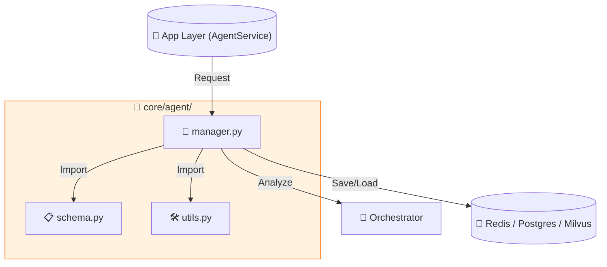

# 🤖 AI Agent Module

`services/ai_hub/core/agent/` 디렉토리는 AI 에이전트의 생성, 관리, 추천, 배포와 관련된 핵심 로직을 담당합니다.
이 모듈은 **응집도(Cohesion)**를 높이고 **역할 분리(Separation of Concerns)**를 위해 3개의 주요 파일로 구성됩니다.

---

## 📂 파일 구성 및 역할 (File Roles)

### 1️⃣ `manager.py` (Core Logic)
*   **역할**: 에이전트의 전체 수명 주기(Lifecycle)를 관리하는 **컨트롤 타워**입니다.
*   **주요 기능**:
    *   **Draft Creation**: 사용자 채팅을 통해 초안 생성 (`redis` 임시 저장)
    *   **Recommendation**: 사용자 질문에 맞는 에이전트 추천 (`orchestrator` 분석 + `milvus` 검색)
    *   **Publish**: 최종 에이전트 배포 (`postgres` 영구 저장 + `milvus` 벡터화)
*   **상호작용 (Interactions)**:
    *   `⬅️ App Layer`: `AgentService`로부터 모든 요청을 받습니다. (위임)
    *   `➡️ Orchestrator`: 의도 분석 및 템플릿 채우기 요청.
    *   `➡️ DB Layer`: `Redis`(Draft), `Milvus`(Vector), `Postgres`(Meta)와 통신.
    *   `➡️ Internal`: `schema.py`, `utils.py`를 Import하여 사용.

### 2️⃣ `schema.py` (Data Contract)
*   **역할**: 에이전트 데이터의 **표준 구조(Template/Schema)를 정의**합니다.
*   **주요 기능**:
    *   `get_standard_template()`: 에이전트가 가져야 할 필수 필드(Golden Rule) 정의.
*   **상호작용 (Interactions)**:
    *   `manager.py`: 에이전트 생성 시 이 템플릿을 로드합니다.
    *   `orchestrator`: 이 스키마에 맞춰 데이터를 채워줍니다. (Orchestration)

### 3️⃣ `utils.py` (Helper Tools)
*   **역할**: 비즈니스 로직과 무관한 **순수 유틸리티 함수**들을 모아놓은 도구 상자입니다.
*   **주요 기능**:
    *   `generate_agent_id()`: 고유 ID 생성 (UUID).
    *   `safe_json_loads()`: 안전한 JSON 파싱.
*   **상호작용 (Interactions)**:
    *   `manager.py`: 필요할 때 도구처럼 가져다 씁니다.

---

## 🔗 상호작용 다이어그램 (Interaction Map)

## 📝 데이터 흐름 예시 (Flow Example)

1.  **요청**: App이 `manager.create_draft()` 호출
2.  **준비**: `manager`가 `schema.get_standard_template()`으로 빈 양식 준비
3.  **도구**: `manager`가 `utils.generate_agent_id()`로 ID 생성
4.  **분석**: `manager`가 `orchestrator`에게 내용 분석 요청
5.  **저장**: `manager`가 `redis`에 결과 저장
